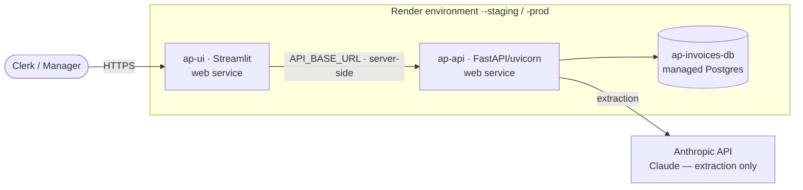

# Architecture

How the AP invoice processor is built and how it's deployed (on Render). The
application is provider-agnostic — only *where* the containers, database, and
secrets live is platform-specific — so the same image runs locally, on Render, or
on AWS unchanged.

> Companion docs: [OPERATIONS.md](OPERATIONS.md) (deploy/run/runbooks),
> [USAGE.md](USAGE.md) (using the app), [API.md](API.md) (endpoints),
> [`../CLAUDE.md`](../CLAUDE.md) (invariants).

## 1. What it does

A supplier invoice PDF goes in; out comes structured extraction, seven-check
validation evidence, and a reasoned **`APPROVE | FLAG | REJECT`** verdict — with an
append-only governance trail recording every step and a role-based UI on top.

The pipeline is a fixed sequence, and **the stage boundary is the design**:

```
PDF ─ingest→ extract ──→ match ────→ validate ──→ decide ───→ verdict
            (Claude)   (PO+vendor)  (7 checks)   (policy)    (+ trail)
            extraction  evidence ▸ gather facts   apply policy ▸ one verdict
```

Validation **gathers facts**; the engine **applies policy**. The validator never
emits a verdict; the engine never re-derives facts. The decision path is
deterministic and LLM-free, so a verdict is reproducible byte-for-byte and
auditable — only *extraction* calls the model.

## 2. Components

| Component | Code | Responsibility |
|---|---|---|
| **API** | `app/` (FastAPI) | Auth, pipeline entry, runs/review/dashboard/policy/audit/admin endpoints |
| **Pipeline** | `app/pipeline/orchestrator.py` | The single entry (`process_invoice`): ingest → extract → match → validate → decide |
| **Extraction** | `app/extract/` | PDF → JSON via Claude; text (pdfplumber) vs vision (PyMuPDF → image) path auto-detected |
| **Validation** | `app/validate/` | The seven checks → an evidence report (never a verdict) |
| **Decision** | `app/decide/` | Pure resolver (evidence + confidence + policy → verdict) + race-safe PO draw-down + persistence |
| **Governance** | `app/governance/recorder.py` | Append-only trail (runs, events, reports, verdicts) + actor identity |
| **Ingest worker** | `app/ingest/worker.py` | Sweep a landing area → pipeline → archive partitioned by `YYYYMMDD` |
| **UI** | `ui/` (Streamlit) | Thin client over the API — run view, batch ingest, review queue, processed, dashboard, policy |

The UI holds **no business logic** — it calls endpoints and renders. The worker and
the API both call the *same* `process_invoice`, so an invoice gets an identical trail
whether a clerk uploaded it or it was swept from the landing area.

## 3. Deployment (Render)

One Docker image, run as two web services plus a managed Postgres — defined in
[`render.yaml`](../render.yaml) and deployed per environment (staging, production).



- **One image, two roles.** The same [`Dockerfile`](../Dockerfile) runs the API
  (`uvicorn app.main:app`) and the UI (`streamlit run ui/app.py`, with `API_BASE_URL`
  → the API). The browser only talks to the Streamlit URL; the UI calls the API
  **server-side**, so there's no CORS.
- **Database.** A managed Postgres per environment. The API self-applies the schema
  and seeds reference data + users on first boot (idempotent `CREATE TABLE IF NOT
  EXISTS`).
- **Secrets as env.** `ANTHROPIC_API_KEY` and `JWT_SECRET` are Render env vars (the
  app refuses the dev JWT fallback when `ENVIRONMENT=production`).
- **CI/CD.** GitHub Actions runs the test suite on every PR; a merge into `staging`
  or `production` re-runs it and, only if green, fires that environment's Render
  deploy hook (`autoDeploy: false`, so tests gate every release). See OPERATIONS.

**Batches.** On Render (no object store, ephemeral disk) a batch enters via the UI's
**multi-file upload** on the Batch ingest page. In production the worker design takes
over: invoices arrive in an S3 *landing* bucket partitioned by date, the worker
(`app.ingest.worker`, a scheduled task or S3-event trigger) sweeps and processes them,
then moves each to an *archive* bucket under the same `YYYYMMDD` — the same
`process_invoice`, stamped as the system actor. Locally these are `data/landing/` and
`data/archive/<YYYYMMDD>/`.

**Scales to AWS unchanged.** The same image maps to ECS Fargate (API + UI services +
a scheduled worker task) behind an ALB, with RDS Multi-AZ, S3 landing/archive buckets,
and Secrets Manager — no code change, only where things run.

## 4. Request flows

**Interactive (clerk uploads):**

```mermaid
sequenceDiagram
    participant C as Clerk (UI)
    participant A as API
    participant M as Claude
    participant DB as Postgres
    C->>A: POST /auth/login → JWT
    C->>A: POST /invoices/process (PDF + bearer)
    A->>M: extract (text or vision)
    M-->>A: structured JSON + confidence
    A->>A: match → validate (7 checks) → decide (pure)
    A->>DB: write run, events, report, verdict; draw PO down on APPROVE
    A-->>C: {extraction, validation, decision, events}
    Note over C: UI replays the real events as a live stage tracker
```

**Automated:** `landing → worker (process_invoice) → archive/YYYYMMDD/` — same
pipeline, system actor; verdicts land in the same tables and show up in the queue and
dashboard alongside interactive runs.

**Oversight:** managers read the dashboard (`/dashboard/kpis|trends`,
`/invoices/runs`, `/audit/{invoice}`); both roles use **Processed** to monitor and
**manually reject** an auto-decision; the **review queue** works flagged items. Every
human action is appended to the trail with the actor.

## 5. Data model (Postgres)

Reference (seeded): `vendors`, `purchase_orders`, `po_line_items`, `policy_config`
(governance-as-data: ceiling, tolerance, confidence gate, severity map, per-invoice
costs). Operational: `pipeline_runs` (+ `extraction` JSONB), `invoices` (the
`UNIQUE(invoice_number, vendor_name)` dedup ledger), `validation_reports`,
`governance_events` (append-only), `verdicts` (**the one place a verdict is written**),
`review_actions`, `invoice_files` (the stored source PDF), `users`. Every operational
row carries a `tenant_id`.

## 6. Cross-cutting concerns

- **Security** — JWT (HS256) bearer auth; two roles (clerk/manager) enforced by route
  guards (403 vs 404). Secrets in env, never in the image. The append-only governance
  trail gives a complete audit history.
- **Multi-tenancy** — one constant tenant today, but every query filters by
  `tenant_id` and every operational row carries it, so going multi-tenant is a `WHERE`
  change plus a per-request tenant claim, not a migration.
- **Determinism & money-safety** — verdicts are reproducible (LLM-free decision path);
  the PO draw-down is race-safe (`SELECT … FOR UPDATE`, downgrade rather than
  over-commit) and lives in exactly one place, shared by the auto-decision and the
  human-approve path.
- **Resilience** — governance writes are best-effort (a logging failure never breaks
  the pipeline it observes); a failed landing file stays for retry/DLQ.
- **Cost** — extraction is the dominant variable cost (one model call per invoice); the
  touchless-savings KPI quantifies the manual-vs-auto trade-off.

## 7. Key design choices (and trade-offs)

- **Sync psycopg3 + raw SQL, no ORM/migrations framework** — small surface, transparent
  SQL, idempotent schema; trades ORM ergonomics for clarity. FastAPI sync handlers run
  in the threadpool.
- **Decision engine is pure & data-driven** — policy lives in `policy_config` (editable
  live via `PUT /policy`), so tuning the ceiling or a severity is a data change, not a
  deploy. The tension to manage is **STP rate vs false-approve rate** — the ceiling +
  confidence gate are the dials.
- **Thin UI** — Streamlit calls the API only; the same API backs curl, integrations, and
  the worker. The UI can be replaced without touching business logic.
- **One pipeline entry** — interactive and automated ingestion converge on
  `process_invoice`, guaranteeing one consistent trail and verdict path.
