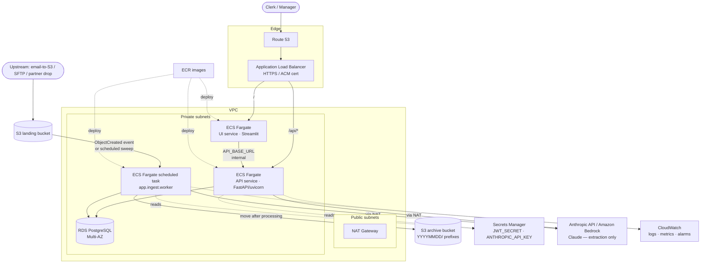

# Architecture (AWS deployment)

How this AP invoice processor is built, and how it would run on AWS. The system
is provider-agnostic — the only AWS-specific pieces are *where* the containers,
database, object storage, and secrets live; the application code is unchanged.

> Companion docs: [OPERATIONS.md](OPERATIONS.md) (deploy/run/runbooks),
> [API.md](API.md) (endpoints), [`../CLAUDE.md`](../CLAUDE.md) (invariants).

---

## 1. What the system does

A supplier invoice PDF goes in; out comes structured extraction, six-check
validation evidence, and a reasoned **`APPROVE | FLAG | REJECT`** verdict — with
an append-only governance trail recording every step and a role-based UI on top.

The pipeline is a fixed sequence, and **the stage boundary is the design**:

```
PDF ─ingest→ extract ──→ match ────→ validate ──→ decide ───→ verdict
            (Claude)   (PO+vendor)  (7 checks)   (policy)    (+ trail)
            extraction  evidence ▸ gather facts   apply policy ▸ one verdict
```

Validation **gathers facts**; the engine **applies policy**. The validator never
emits a verdict; the engine never re-derives facts. The decision path is
deterministic and LLM-free, so a verdict is reproducible byte-for-byte and
auditable — only *extraction* calls the model.

## 2. Logical components

| Component | Code | Responsibility |
|---|---|---|
| **API** | `app/` (FastAPI) | Auth, pipeline entry, runs/review/dashboard/policy/audit endpoints |
| **Pipeline** | `app/pipeline/orchestrator.py` | The single entry (`process_invoice`) — ingest → extract → match → validate → decide |
| **Extraction** | `app/extract/` | PDF → JSON via Claude; text (pdfplumber) vs vision (PyMuPDF→image) path auto-detected |
| **Validation** | `app/validate/` | The seven checks → an evidence report (never a verdict) |
| **Decision** | `app/decide/` | Pure resolver (evidence + confidence + policy → verdict) + race-safe PO draw-down + persistence |
| **Governance** | `app/governance/recorder.py` | Append-only trail (runs, events, reports, verdicts) + actor identity |
| **Ingest worker** | `app/ingest/worker.py` | Sweep a landing area → pipeline → archive partitioned by `YYYYMMDD` |
| **UI** | `ui/` (Streamlit) | Thin client over the API — login, run view, batch ingest, processed/monitor, review queue, dashboard, policy |

The UI holds **no business logic** — it calls endpoints and renders. The
worker and the API both call the *same* `process_invoice`, so an invoice gets an
identical trail whether a clerk uploaded it or it arrived in the landing bucket.
Batches arrive as an S3 *landing* prefix partitioned by date that the worker sweeps
to an *archive* prefix under the same date; the Render demo (no S3) ingests a batch
via the UI's multi-file upload instead — the same pipeline either way.

## 3. AWS topology



**Component mapping**

- **Route 53 + ALB (ACM/HTTPS)** — single public entry. Path routing: `/` → the
  Streamlit **UI** target group; `/api/*` → the **API** target group (or keep the
  API on an internal ALB and expose only the UI). Health checks hit
  `GET /health`.
- **ECS Fargate** — two long-running services from the **same container image**
  (`ECR`), different entrypoints: `uvicorn app.main:app` (API) and
  `streamlit run ui/app.py` (UI, with `API_BASE_URL` → the API). Stateless →
  horizontal autoscaling on CPU/req-count.
- **Ingest worker** — the same image, entrypoint `python -m app.ingest.worker`,
  run as an **EventBridge-scheduled ECS task** (sweep the landing prefix every N
  minutes) or triggered per-object by an **S3 ObjectCreated → Lambda/Step
  Functions** shim. It moves each object to the archive bucket under a
  `YYYYMMDD/` prefix after a successful run; a failed file stays in landing (a
  real deployment routes it to an SQS dead-letter queue).
- **RDS PostgreSQL (Multi-AZ)** — the one operational store (raw SQL, no ORM).
  Private subnets; security group admits only the ECS tasks. The app
  self-applies the schema on startup (idempotent `CREATE TABLE IF NOT EXISTS`).
- **S3** — `landing` (invoices arrive) and `archive` (processed, date-partitioned)
  buckets. Locally these are `data/landing/` and `data/archive/<YYYYMMDD>/`.
- **Secrets Manager** — `JWT_SECRET` (HS256 signing key; the app refuses the dev
  fallback when `ENVIRONMENT=production`) and `ANTHROPIC_API_KEY`, injected as
  task secrets. Postgres credentials likewise (or RDS IAM auth).
- **Model** — extraction calls **Claude** via the Anthropic API (egress through
  the NAT gateway) or **Amazon Bedrock** (Claude) to keep traffic in-VPC. This is
  the *only* external model call; the decision path is model-free.
- **CloudWatch** — container logs, custom metrics, and alarms (see OPERATIONS).

## 4. Request & data flows

**A. Interactive (clerk uploads)**

```mermaid
sequenceDiagram
    participant C as Clerk (UI)
    participant A as API
    participant M as Claude
    participant DB as Postgres
    C->>A: POST /auth/login → JWT
    C->>A: POST /invoices/process (PDF + bearer)
    A->>M: extract (text or vision)
    M-->>A: structured JSON + confidence
    A->>A: match → validate (7 checks) → decide (pure)
    A->>DB: write run, events, report, verdict; draw PO down on APPROVE
    A-->>C: {extraction, validation, decision, events}
    Note over C: UI replays the real events as a live stage tracker
```

**B. Automated (landing → archive)** — `upstream → S3 landing → worker
(process_invoice) → S3 archive/YYYYMMDD/`. Same pipeline, stamped as the
**system** actor. Verdicts/flags land in the same tables, so they show up in the
review queue and the dashboard alongside interactive runs.

**C. Oversight** — managers read the **dashboard** (`/dashboard/kpis|trends`,
`/invoices/runs`, `/audit/{invoice}`); both roles use **Processed** to monitor
every AI decision and **manually reject** (override) one; the **review queue**
works flagged items. Every human action is appended to the trail with the actor.

## 5. Data model (Postgres)

Reference (seeded): `vendors`, `purchase_orders`, `po_line_items`,
`policy_config` (governance-as-data: ceiling, tolerance, confidence gate,
severity map, per-invoice costs). Operational: `pipeline_runs` (+ `extraction`
JSONB), `invoices` (the `UNIQUE(invoice_number, vendor_name)` dedup ledger),
`validation_reports`, `governance_events` (append-only), `verdicts` (**the one
place a verdict is written**), `review_actions`, `invoice_files` (the stored
source PDF), `users`. Every operational row carries a `tenant_id`.

## 6. Cross-cutting concerns

- **Security** — JWT (HS256) bearer auth; two roles (clerk/manager) enforced by
  route guards (403 vs 404 distinction). Secrets in Secrets Manager, never in
  code/image. TLS in transit (ACM at the ALB); encryption at rest (RDS + S3
  KMS). IAM task roles scoped least-privilege (read landing / write archive /
  read named secrets / invoke Bedrock). The hash-chained-by-`run_id` governance
  trail gives a complete, append-only audit history.
- **Multi-tenancy** — one constant tenant today, but every query filters by
  `tenant_id` and every operational row carries it, so going multi-tenant is a
  `WHERE` change (and a per-request tenant claim), not a migration.
- **Determinism & money-safety** — verdicts are reproducible (LLM-free decision
  path); the PO draw-down is race-safe (`SELECT … FOR UPDATE`, downgrade rather
  than over-commit) and lives in exactly one place, shared by the auto-decision
  and the human approve path.
- **Resilience** — governance writes are best-effort (a logging failure never
  breaks the pipeline it observes); a failed landing file stays for retry/DLQ;
  RDS Multi-AZ + stateless ECS services + a connection pool per task.
- **Scaling** — API/UI scale horizontally (stateless, JWT). The bottleneck is
  extraction latency (model-bound) + RDS connections; tune Fargate count and the
  psycopg pool together. The worker scales by sharding the landing prefix or
  raising concurrency.
- **Cost** — extraction is the dominant variable cost (one model call per
  invoice); the touchless-savings KPI quantifies the manual-vs-auto trade-off.

## 7. Key design choices (and trade-offs)

- **Sync psycopg3 + raw SQL, no ORM/migrations framework** — small surface,
  transparent SQL, idempotent schema; trades ORM ergonomics for clarity and
  control. FastAPI sync handlers run in the threadpool.
- **Decision engine is pure & data-driven** — policy lives in `policy_config`
  (editable live via `PUT /policy`), so tuning the auto-approve ceiling or a
  severity is a data change, not a deploy. The tension to manage is **STP rate
  vs false-approve rate** — the ceiling + confidence gate are the dials.
- **Thin UI** — Streamlit calls the API only; the same API backs curl,
  integrations, and the worker. The UI can be redeployed or replaced without
  touching business logic.
- **One pipeline entry** — interactive and automated ingestion converge on
  `process_invoice`, guaranteeing one consistent trail and verdict path.
